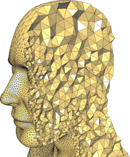

# Physics-Based Animation: The Finite Element Method
In this assignment you will learn to implement the finite element method for both volumetric and thin shell objects.

**WARNING:** Do not create public repos or forks of this assignment or your solution. Do not post code to your answers online or in the class discussion board. Doing so will result in a 20% deduction from your final grade. 

## Checking out the code and setting up the python environment
These instructions use [Conda](https://docs.conda.io/projects/conda/en/stable/user-guide/getting-started.html) for virtual environment. If you do not have it installed, follow the 
instructions at the preceeding link for your operating system

Checkout the code ```git clone git@github.com:dilevin/physics-based-animation-fem.git {ROOT_DIR}```, where **{ROOT_DIR}*** is a directory you specify for the source code. 

Next create a virtual environment and install relevant depencies install python dependencies.
```
cd {ROOT_DIR}
conda create -n csc417  python=3.12 -c conda-forge
conda activate csc417
pip install -e . 
```
Optionally, if you have an NVIDIA GPU you might need to install CUDA if you want to use the GPU settings
```
conda install cuda -c nvidia/label/cuda-12.1.0
```
Assignment code templates are stored in the ```{ROOT_DIR}/assginment``` directory. 

**WIKNDOWS NOTE:*** If youb want to run the assignmetns using your GPU you may have to force install torch with CUDA support using ```pip install torch torchvision torchaudio --index-url https://download.pytorch.org/whl/cu121```

## Tools You Will Use
1. [NVIDIA Warp](https://github.com/NVIDIA/warp) -- python library for kernel programming
2. [PyTorch](https://pytorch.org/) -- python library for array management, deep learning etc ...
3. [SymPy](https://www.sympy.org/en/index.html) -- python symbolic math package
   
## Running the Assignment Code
```
cd {ROOT_DIR}
python main.py --scene=tests/{SCENE_PYTHON_FILE}.py
```
By default the assignment code runs on the cpu, you can run it using your GPU via:
```
python main.py --scene=tests/{SCENE_PYTHON_FILE}.py --device=cuda
```
Finally, the code runs, headless and can write results to a USD file which can be viewed in [Blender](https://www.blender.org/):
```
python main.py --scene=tests/{SCENE_PYTHON_FILE}.py --usd_output={FULL_PATH_AND_NAME}.usd --num_steps={Number of steps to run}
```
## Assignment Structure and Instructions
1. You are responsible for implementing all functions found in the [assignments](./assignment) subdirectory.
2. The [tests](./tests) subdirectory contains the scenes, specified as python files,  we will validate your code against.
3. The [test_output](./test_output) subdirectory contains output from the solution code that you can use to validate your code. This output comes in two forms. (1) **USD (Universal Scene Description)** files which contain simulated results. These can be played back in any USD viewer. I use [Blender](https://www.blender.org/). You can output your own simulations as USD files, load both files in blender and examine the simulations side-by-side. (2) Two.pt files which contains the global mass matrix (as a dense matrix) for the one_tet_fall.py scene and the bunny_fall.py scene which you can [load](https://docs.pytorch.org/docs/stable/generated/torch.load.html) and compare your own code to.

In this assignment you will get a chance to implement one of the  gold-standard methods for simulating elastic objects -- the finite element method (FEM). Unlike the particles in the previous [assignment](https://github.com/dilevin/CSC417-a2-mass-spring-3d), the finite-element method allows us compute the motion of continuous volumes of material. This is enabled by assuming that the motion of a small region can be well approximated by a simple function space. Using this assumption we will see how to generate and solve the equations of motion.   

FEM has wonderfully practical origins, it was created by engineers to study [complex aerodynamical and elastic problems](https://en.wikipedia.org/wiki/Finite_element_method) in the 1940s. My MSc supervisor used to regale me with stories of solving finite element equations by hand on a chalkboard. With the advent of modern computers, its use as skyrocketed.  

FEM has two main advantages over mass-spring systems. First, the behaviour of the simulated object is less dependent on the topology of the simulation mesh. Second, unlike the single stiffness parameter afforded by mass spring systems, FEM allows us to use a richer class of material models that better represent real-world materials. 

## Resources

Part I of this [SIGGRAPH Course](http://www.femdefo.org), by Eftychios Sifakis and Jernej Barbic, is an excellent source of additional information and insight, beyond what you will find below. 

## Background

In this assignment you will get a chance to implement one of the  gold-standard methods for simulating elastic objects -- the finite element method (FEM). Unlike the particles in the previous [assignment](https://github.com/dilevin/CSC417-a2-mass-spring-3d), the finite-element method allows us compute the motion of continuous volumes of material. This is enabled by assuming that the motion of a small region can be well approximated by a simple function space. Using this assumption we will see how to generate and solve the equations of motion.   

FEM has wonderfully practical origins, it was created by engineers to study [complex aerodynamical and elastic problems](https://en.wikipedia.org/wiki/Finite_element_method) in the 1940s. My MSc supervisor used to regale me with stories of solving finite element equations by hand on a chalkboard. With the advent of modern computers, its use as skyrocketed.  

FEM has two main advantages over mass-spring systems. First, the behaviour of the simulated object is less dependent on the topology of the simulation mesh. Second, unlike the single stiffness parameter afforded by mass spring systems, FEM allows us to use a richer class of material models that better represent real-world materials. 

## Resources

Part I of this [SIGGRAPH Course](http://www.femdefo.org), by Eftychios Sifakis and Jernej Barbic, is an excellent source of additional information and insight, beyond what you will find below. 


## The Finite Element method

The idea of the finite element method is to represent quantities inside a volume of space using a set of scalar *basis* or *shape* functions  where  is a point inside the space volume. We then represent any quantity inside the volume as a linear combination of these basis functions:

<p align="center"></p>

where  are weighting coefficients. Designing a finite element method involves making a judicious choice of basis functions such that we can compute the 's efficiently. Spoiler Alert: in the case of elastodynamics, these 's will become our generalized coordinates and will be computed via time integration. 

## Our Geometric Primitive: The Tetrahedron

For this assignment we will use a [tetrahedron](https://en.wikipedia.org/wiki/Tetrahedron) as the basic space volume. The reason we work with tetrahedra is two-fold. First, as you will see very soon, they allow us to easily define a simple function space over the volume. Second, there is available [software](https://github.com/Yixin-Hu/TetWild) to convert arbitrary triangle meshes into tetrahedral meshes.

  

## A Piecewise-Linear Function Space 

Now we are getting down to the nitty-[gritty](https://en.wikipedia.org/wiki/Gritty_(mascot)) -- we are going to define our basis functions. The simplest, useful basis functions we can choose are linear basis functions, so our goal is to define linear functions inside of a tetrahedron. Fortunately such nice basis functions already exist! They are the [barycentric coordinates](https://en.wikipedia.org/wiki/Barycentric_coordinate_system). For a tetrahedron there are four (4) barycentric coordinates, one associated with each vertex. We will choose  to be the  barycentric coordinate. 

Aside from being linear, barycentric coordinates have another desireable property, called the *[Kronecker delta](https://en.wikipedia.org/wiki/Kronecker_delta) property* (or fancy Identity matrix as I like to think of it). This is a fancy-pants way of saying that the  barycentric coordinate is zero (0) when evaluated at any vertex, , of the tetrahedron, , and one (1) when evaluated at . What's the practical implication of this? Well it means that if I knew my function , then the best values for my 's would be , or the value of  evaluated at each vertex of my tetrahedron. 

All of this means that a reasonable way to approximate any function in our tetrahedron is to use

<p align="center"></p>

where  are now the tetrahedron barycentric coordinates and  are the values of  at the nodes of the tetrahedron. Because our basis functions are linear, and the weighted sum of linear functions is still linear, this means that we are representing our function using a linear function space. 

## The Extension to 3D Movement

To apply this idea to physics-based animation of wiggly bunnies we need to more clearly define some of the terms above. First, we need to be specific about what our function  will be. As with the particles in the previous assignments, what we care about tracking is the position of each mesh vertex, in the world, over time. For the  vertex we can denote this as . We are going to think of this value as a mapping from some undeformed space  into the real-world. So the function we want to approximate is  which, using the above, is given by

<p align="center"></p>

The take home message is that, because we evaluate 's in the undeformed space, we need our tetrahedron to be embedded in this space. 

## The Generalized Coordinates 

Now that we have our discrete structure setup, we can start "turning the crank" to produce our physics simulator. A single tetrahedron has four (4) vertices. Each vertex has a single  associated with it. As was done in assignment 2, we can store these *nodal positions* as a stacked vector and use them as generalized coordinates, so we have

<p align="center"></p>

Now let's consider the velocity of a point in our tetrahedron. Given some specific , the velocity at that point is

<p align="center"></p>

However, only the nodal variables actually move in time so we end up with

<p align="center"></p>

Now we can rewrite this whole thing as a matrix vector product

<p align="center"></p>

where  is the  Identity matrix. 

## The Kinetic Energy of a Single Tetrahedron

Now that we have generalized coordinates and velocities we can start evaluating the energies required to perform physics simulation. The first and, and simplest energy to compute is the kinetic energy. The main difference between the kinetic energy of a mass-spring system and the kinetic energy of an FEM system, is that the FEM system must consider the kinetic energy of every infinitesimal piece of mass inside the tetrahedron. 

Let's call an infinitesimal chunk of volume . If we know the density  of whatever our object is made out of, then the mass of that chunk is  and the kinetic energy,  is . To compute the kinetic energy for the entire tetrahedron, we need to integrate over it's volume so we have

<p align="center"></p>

BUT~  is constant over the tetrahedron so we can pull that outside the integration leaving

<p align="center"></p>

in which the *per-element* mass matrix, , makes an appearance.. In the olden days, people did this integral by hand but now you can use symbolic math packages like *Mathematica*, *Maple* or even *Matlab* to compute its exact value. 

## The Deformation of a Single Tetrahedron

Now we need to define the potential energy of our tetrahedron. Like with the spring, we will need a way to measure the deformation of our tetrahedron. Since the definition of length isn't easy to apply for a volumetric object, we will try something else -- we will define a way to characterize the deformation of a small volume of space. Remember that all this work is done to approximate the function  which maps a point in the undeformed object space, , to the world, or deformed space. Rather than consider what happens to a point under this mapping, let's consider what happens to a vector.  

To do that we pick two arbitary points in the undeformed that are infinitesimally close. We can call them  and  (boring names I know). The vector between them is . Similarly the vector between their deformed counterparts is . Because we chose the undeformed points to be infinitesimally close and , we can 
use Taylor expansion to arrive at

<p align="center"></p>

where  is called the deformation gradient. Remember,  results from differentiating a -vector by another -vector so it is a  matrix.

Because  is pointing in an arbitrary direction, , captures information about how any  changes locally, it encodes volumetric deformation. 

The FEM discretization provides us with a concrete formula for  which can be differentiated to compute . *An important thing to keep in mind --* because our particular FEM uses linear basis functions inside of a tetrahedron, the deformation gradient is a constant. Physically this means that all 's are deformed in exactly the same way inside a tetrahedron.

Given  we can consider the squared length of any  

<p align="center"></p>

Like the spring strain,  is invariant to rigid motion so it's a pretty good strain measure. 

## The Potential Energy of a Single Tetrahedron

The potential energy function of a tetrahedron is a function that associates a single number to each value of the deformation gradient. Sadly, for the FEM case, things are a little more complicated than just squaring  (but thankfully not much). 

### The Strain Energy density
In this assignment we use the Stable Neohookean strain energy density from Theodore Kim's [Dynamic Deformables](https://www.tkim.graphics/DYNAMIC_DEFORMABLES/). The formula for this energy relies on computing what are called invariants of the Right Cauchy-Green Strain tensor. In this case we will define $I_2 = tr(\mathbf{F}^T\mathbf{F})$, where $\mathbf{F}\in\mathcal{}R^{3x3}$ is the deformation gradient and $tr()$ computes the trace of a matrix. We will also define $I_3 = det(\mathbf{F}$ which is just the determinant of the deformation gradient. The stable Neohookean potential energy is then given by:

$\Psi(\mathbf{F}) = \frac{1}{2}\mu(I_2 - 3) - \mu(I_3-1) + \frac{1}{2}(I_3 -1)^2$ 


### Numerical quadrature
Typically we don't evaluate potential energy integrals by hand. They get quite impossible, especially as the FEM basis becomes more complex. To avoid this we typically rely on [numerical quadrature](https://en.wikipedia.org/wiki/Numerical_integration). In numerical quadrature we replace an integral with a weighted sum over the domain. We pick some quadrature points  (specified in barycentric coordinates for tetrahedral meshes) and weights  and evaluate

<p align="center"></p>

However, for linear FEM, the quadrature rule is exceedingly simple. Recall that linear basis functions imply constant deformation per tetrahedron. That means the strain energy density function is constant over the tetrahedron. Thus the perfect quadrature rule is to choose  as any point inside the tetrahedron (I typically use the centroid) and  as the volume of the tetrahedron. This is called *single point* quadrature because it estimates the value of an integral by evaluating the integrated function at a single point. 

## Forces and stiffness

The per-element generalized forces acting on a single tetrahedron are given by 

<p align="center"></p>

and the stiffness is given by 

<p align="center"></p>

These can be directly computed from the quadrature formula above. Again, typically one uses symbolic computer packages to take these derivatives and you are allows (and encouraged) to do that for this assignment. 

For a tetrahedron the per-element forces are a  vector while the per-element stiffness matrix is a dense,  matrix. 

## From a Single Tetrahedron to a Mesh 
Extending all of the above to objects more complicated than a single tetrahedron is analogous to our previous jump from a single spring to a mass-spring system. 



The initial step is to divide the object to be simulated into a collection of tetrahedra. Neighboring tetrahedra share vertices. We now specify the generalized coordinates of this entire mesh as 

<p align="center"></p> 

where  is the number of vertices in the mesh. We use selection matrices ) which yield identical assembly operations for the global forces, stiffness and mass matrix. In this assignment the assembly code is given to you in the [given](./given) subdirectory. Feel free to take a look at [it](./given/mass_matrix_object.py)

## Some Debugging Hints
1. Always test the one_tet_* examples first, this rules out anyting going wrong with assembly or other global operations
2. Check results in order of complexity of simulation, so start with *_stationary, then move onto *_falling, then *_deflate and finally *_swinging. 
3. If you are using Visual Studio Code or Cursor, use the [interactive debugger](https://code.visualstudio.com/docs/python/debugging) and python debugging console.
   
## Admissable Code and Libraries
You are allowed to use SymPy for computing formulas for integrals, derivatives and gradients. You are allowed to use any functions in the warp and warp.sparse packages. You ARE NOT allowed to use code from other warp packages like warp.fem. You are not allowed to use any of warps specialized spatial data structures for storing meshes, volumes or doing spatial subdivision. You cannot use code from any other external simulation library.  

## Hand-In
We will collect and grade the assignment using MarkUs, link **coming soon**

## Late Penalty
The late penalty is the same as for the course, specified on the main github page. 
